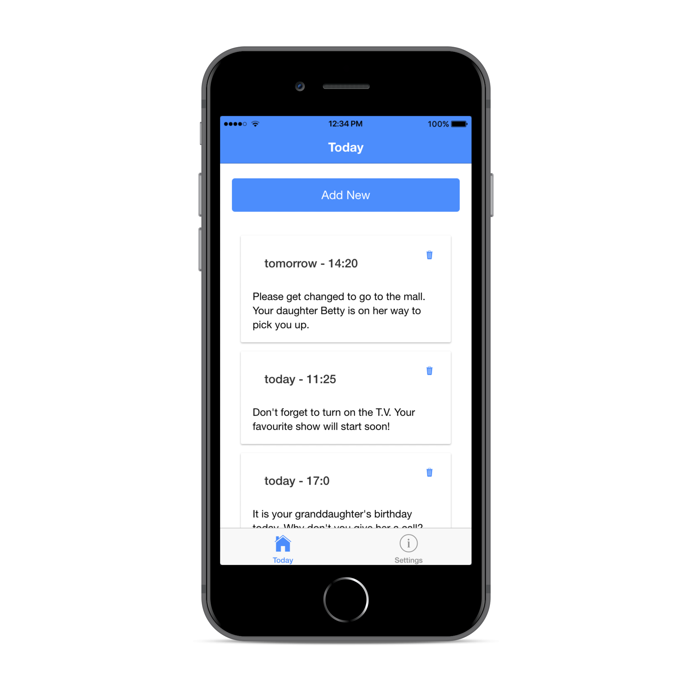
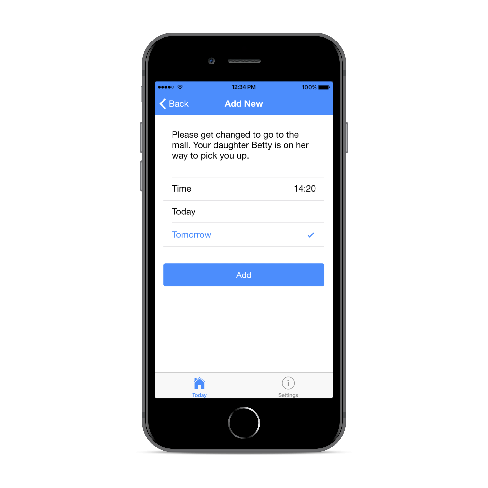

# Unforgettable

A project created to aid people who suffer from Alzheimer's disease. Unforgettable will speak to them and remind them to do the things throughout their day. The project is split into 3 parts: a local application, a server and a mobile application.
The local and mobile application communicate with each other by making requests to the server and database. The mobile application was designed to be run by the person's caretaker or family member.

## Project Structure
### Local Application
The local application was written in python to communicate with the server. It uses Amazon Polly through boto3, an Amazon Web Services SDK for python, to turn text to synthesized lifelike speech. It also uses the requests python module to make requests to the server API.
The local app has greetings, time and eating reminders pre-defined by the user. Customized reminders can be added through the mobile application.

### Mobile Application
The mobile application was built using the Ionic Framework. Ionic is an SDK for hybrid mobile app development built on top of Angular. It allows one project to be run on Android, iOS, Windows Phone or as a web app. This allows unforgettable to be run on almost any mobile device. It was developed in HTML, CSS and TypeScript.

The home page of the application displays the custom messages added by the caretaker, which are stored in a PostgreSQL database connected to the server. Messages can be deleted by tapping on the trash can icon.

The add reminder page allows the caretaker to customize a reminder that will be used by the local application.

### Server
The server was written in Python using flask and is hosted on the Heroku. It is connected to a PostgreSQL database to store the reminders, which is also hosted on Heroku. A Database Manager python file is used by the server to communicate with the database. The server works as an API that accepts GET and POST request made to it by local application or the mobile application.

## Getting Started
A guide on how to setup the Heroku server, database and deploying the mobile application will be put up soon.
